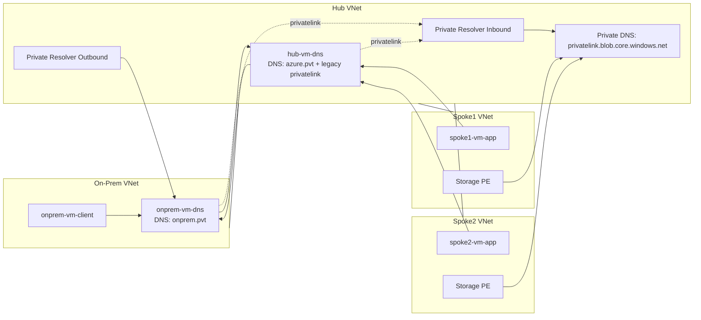

# Architecture Overview

This sandbox models a minimal hub‑and‑spoke DNS topology with a staged migration of the `privatelink.blob.core.windows.net` zone from Linux DNS to Azure Private DNS.

## Topology Summary

- **On‑Prem VNet**: Linux DNS server authoritative for `onprem.pvt` and forwarding for `azure.pvt` and `privatelink.blob.core.windows.net`.
- **Hub VNet**: Linux DNS server authoritative for `azure.pvt` and legacy `privatelink.blob.core.windows.net`, plus Azure Private DNS Resolver.
- **Spoke1 VNet**: Workload VM + Storage private endpoint.
- **Spoke2 VNet**: Workload VM + Storage private endpoint.

## Mermaid Diagram

## Migration Highlights

- **Phase 1**: All DNS served by Linux VMs (legacy).
- **Phase 2**: Azure Private DNS zone created and private endpoints auto‑register records.
- **Phase 3**: Linux DNS forwarders updated to the Resolver inbound endpoint.
- **Phase 4/5**: Spokes migrate one at a time to Azure‑provided DNS.
